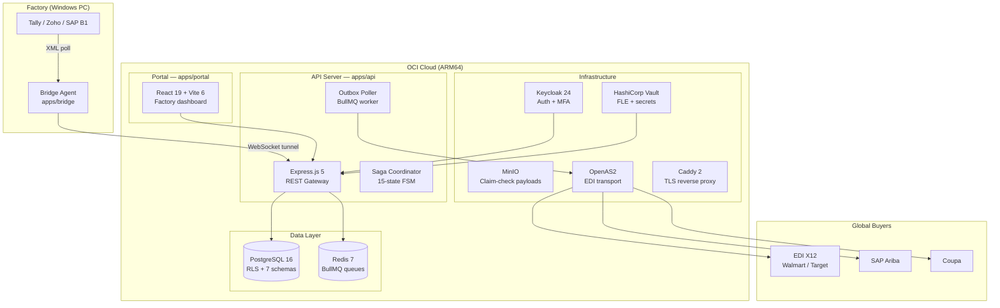

# FactoryConnect

EDI middleware connecting Indian SME factories (Tally, Zoho, SAP B1, ERPNext, Busy, Marg) to global procurement platforms (EDI X12, SAP Ariba, Coupa, Oracle iProc).

> **Status:** Architecture finalized. Phase 1 development in progress on `phase1-dev`.
> **Target:** Q3 2026 — initial factory onboarding.

---

## Architecture Overview



---

## Tech Stack

| Layer | Technology | Notes |
|-------|-----------|-------|
| Runtime | Node.js 22 LTS + TypeScript 5 strict | Zero `any`. Strict mode everywhere. |
| Package manager | pnpm 9.x workspaces | Monorepo — `pnpm-workspace.yaml` |
| API | Express.js 5 | REST + WebSocket tunnel endpoint |
| Validation | Zod 3.x | All inputs. Schemas in `packages/shared/` |
| Database | PostgreSQL 16 + RLS | Raw SQL via `pg`. No ORM. 7 schemas. |
| Migrations | dbmate | SQL files in `packages/database/migrations/` |
| Queue | BullMQ 5 + Redis 7 | Outbox poller, saga workers |
| Auth | Keycloak 24 + TOTP MFA | JWT validation middleware |
| Secrets | HashiCorp Vault | Transit engine for FLE |
| Logging | Pino 9.x | PII redaction on every log line |
| Frontend | React 19 + Vite 6 + Tailwind v4 | Zustand + TanStack Query |
| Proxy | Caddy 2.x | Auto-SSL |
| Containers | Docker Compose (ARM64) | OCI Ampere A1 free tier |

---

## Monorepo Structure

```
factory_connect/
├── apps/
│   ├── api/          @fc/api       — Express.js 5 REST server
│   ├── bridge/       @fc/bridge    — Windows factory agent (Tally XML → WebSocket)
│   └── portal/       @fc/portal    — React 19 dashboard
├── packages/
│   ├── shared/       @fc/shared    — Zod schemas, types, errors, test utils
│   ├── database/     @fc/database  — pg pool, RLS helpers, migrations
│   ├── config/       @fc/config    — ESLint, TypeScript, Vitest base configs
│   └── observability/ @fc/observability — Pino logger, PII redactor
├── docker/           — Dockerfiles, Compose file
├── docs/             — Architecture docs + ADRs
│   └── adr/          — Architecture Decision Records
├── scripts/          — Build and deploy scripts
├── tests/            — Integration test suites
├── Makefile          — All dev commands
└── .github/          — CI workflow, PR template, CODEOWNERS
```

---

## Getting Started

### Prerequisites

- Node.js 22+ (`node --version`)
- pnpm 9+ (`pnpm --version`, or `corepack enable && corepack prepare pnpm@9.15.4 --activate`)
- Docker Desktop (for local infrastructure)

### 1. Clone and install

```bash
git clone <repo-url>
cd factory_connect
pnpm install
```

### 2. Copy environment config

```bash
cp .env.example .env
# Edit .env — set DATABASE_URL, REDIS_HOST, KEYCLOAK_*, VAULT_TOKEN
```

### 3. Start infrastructure services

```bash
make docker-up
# Starts: PostgreSQL 5432, Redis 6379, Keycloak 8080,
#         Vault 8200, MinIO 9000/9001, OpenAS2 4080
```

### 4. Run database migrations

```bash
make db-migrate
```

### 5. Start development servers

```bash
make dev          # All apps in parallel
make dev-api      # API only (port 3000)
make dev-portal   # Portal only (port 5173)
make dev-bridge   # Bridge only
```

---

## Development Commands

```bash
make install      # pnpm install
make dev          # Start all apps (parallel)
make test         # Run all tests (Vitest)
make lint         # ESLint across all packages (zero warnings)
make typecheck    # tsc --noEmit across all packages
make fmt          # Prettier format
make fmt:check    # Check formatting (CI mode)
make db-migrate   # dbmate up
make db-rollback  # dbmate rollback
make db-reset     # dbmate drop + up + seed
make docker-up    # Start infra containers
make docker-down  # Stop infra containers
make clean        # Remove all dist/ folders
```

---

## CI/CD

Every push and PR to `phase1-dev` or `main` runs:

1. **Quality** — typecheck + lint (zero warnings) + format check + `pnpm audit`
2. **Tests** — full Vitest suite with PostgreSQL + Redis, coverage ≥ 80% enforced
3. **Docker build** — verify API and Portal images build successfully

Coverage reports are uploaded as CI artifacts and posted as PR comments.

See `.github/workflows/ci.yml` for the full pipeline.

---

## Git Hooks

Pre-commit hooks run automatically (via `.git/hooks/`):

- **pre-commit** — typecheck + lint on staged files
- **commit-msg** — enforces format: `track-X: description`

---

## Key Architecture Decisions

See `docs/adr/` for full context. Summary:

| ADR | Decision |
|-----|---------|
| [001](docs/adr/001-raw-sql-no-orm.md) | Raw SQL with `pg` — no ORM, no `SELECT *` |
| [002](docs/adr/002-pnpm-monorepo.md) | pnpm workspaces monorepo |
| [003](docs/adr/003-rls-tenant-isolation.md) | PostgreSQL RLS for multi-tenant data isolation |
| [004](docs/adr/004-transactional-outbox.md) | Transactional Outbox pattern for reliable EDI messaging |
| [005](docs/adr/005-fle-vault-transit.md) | HashiCorp Vault Transit for field-level encryption of PII |

---

## Documentation

| Document | Purpose |
|----------|---------|
| `docs/FC_Architecture_Blueprint.md` | Master architecture — 21 patterns, DB schema, security model |
| `docs/FC_SalesOrder_Connector_Design.md` | Phase 1 connector design (complete feature spec) |
| `docs/FC_Development_Plan.md` | 5 parallel tracks, task breakdown, hours |
| `docs/FC_Architecture_Decisions_History.md` | Implementation code samples for all patterns |
| `docs/adr/` | Architecture Decision Records |
| `CONTRIBUTING.md` | Branch naming, commit format, PR process |
| `.claude/CLAUDE.md` | Agent instructions (coding standards, DB rules, error codes) |

---

## Contributing

See [CONTRIBUTING.md](CONTRIBUTING.md) for branch naming, commit format, and PR checklist.

**Branch:** `phase1-dev` is the active development branch. PRs target `phase1-dev`.
